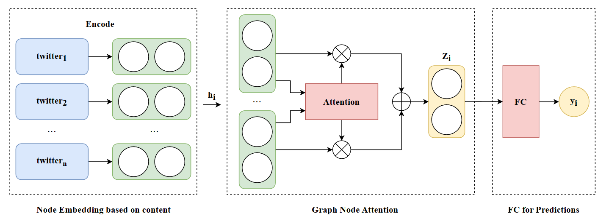

# HoGANet

HoGANet is a Graph Neural Network (GNN) model for stance detection or fake news detection tasks. It's a Homogeneous Graph Network model for node classification. It's modify from [DGL](https://github.com/dmlc/dgl) examples.

## Overview

This repository contains the following files and directories:

- `LICENSE`: The GPL license file for this project.
- `README.md`: This README file providing an overview of the project.
- `datasets/`: Directory for storing datasets used in the project. It contains a DGL graph `graph.dgl`, the labels for every nodes `labels_tweet`, the Bag of Words (BoW) features for every node `tweets_count`, the Bert representation for every node `tweets_bert`
- `main.py`: The main script for running the HoGANet model.
- `model.py`: The implementation of the HoGANet model.
- `utils.py`: Utility functions and helper code. Set the configure here.

## Usage

To use the HoGANet model, follow these steps:

1. Prepare your dataset and place it in the `datasets/` directory. You should provide 3 files, the DGL graph file, the labels for nodes, the features for nodes.
2. Update the necessary configurations and hyperparameters in `main.py` and `utils.py` script.
3. Run the `main.py` script to train and evaluate the HoGANet model.

## Framework

The framework are as follow.

## Datasets

The demo datasets are tweets about US Presidential Election. Due to copyright issues, we cannot provide the raw dataset but only the preprocessed data.

- Node: And the nodes in the graph is tweets. 
- Edge: If the node are retweeted-by a certain user and the user then publish a tweet, then a edge will be added between this tweet. So the connected tweet nodes means they are related.
- Labels: Two labels $\{0,1\}$, means two stances of the tweets.
- Features: We give two features for these tweets. One kind of feature is using bag of word and PCA. $Embedding \in R^{N \times 1000}$. The other kind of feature is computed by Bert-base-uncased. $Embedding \in R^{N \times 768}$. Here $N$ means the number of nodes. In our demo $N = 7439$.
- graph: So we give a homogeneous graph with $num\_nodes=7439, num\_edges=221249$

## Results 
This is experimental results of HoGANet at different training set ratios.

| ratio(%) | 1      | 5      | 10     | 20     | 40     | 60     | 80     |
|----------|--------|--------|--------|--------|--------|--------|--------|
| Accuracy | 0.7863 | 0.8524 | 0.8684 | 0.8730 | 0.8752 | 0.8753 | 0.8804 |
| Precision| 0.7812 | 0.8509 | 0.8877 | 0.8898 | 0.8738 | 0.8690 | 0.8887 |
| Recall   | 0.6425 | 0.7637 | 0.7670 | 0.7759 | 0.7975 | 0.7953 | 0.7899 |
| F1-score | 0.7051 | 0.8049 | 0.8229 | 0.8290 | 0.8339 | 0.8305 | 0.8364 |

## Hyperparameters
| Parameter     | Default Value |
|---------------|--------------|
| lr            | 0.005        |
| num_heads     | 8            |
| hidden_units  | 8            |
| dropout       | 0.6          |
| weight_decay  | 0.001        |
| num_epochs    | 200          |
| patience      | 30           |
| num_classes   | 2            |
| seed          | 42           |

---

# HoGANet模型

HoGANet 是用于立场检测或假新闻检测任务的图神经网络（GNN）模型。它是一种用于节点分类的同构图网络模型，修改自 [DGL](https://github.com/dmlc/dgl) 的示例。

## 概述

该存储库包含以下文件和目录：

- `LICENSE`: 本项目的 GPL 许可证文件。
- `README.md`: 项目的概述性 README 文件。
- `datasets/`: 存储项目中使用的数据集的目录。其中包含一个 DGL 图 `graph.dgl`，每个节点的标签 `labels_tweet`，每个节点的词袋特征 `tweets_count`，每个节点的 BERT 表示 `tweets_bert`
- `main.py`: 运行 HoGANet 模型的主要脚本。
- `model.py`: HoGANet 模型的实现代码。
- `utils.py`: 实用函数和辅助代码。在这里设置配置。

## 使用方法

要使用 HoGANet 模型，请按照以下步骤进行操作：

1. 准备您的数据集并将其放置在 `datasets/` 目录中。您应该提供 3 个文件，即 DGL 图文件、节点标签文件和节点特征文件。
2. 在 `main.py` 和 `utils.py` 脚本中更新必要的配置和超参数。
3. 运行 `main.py` 脚本以训练和评估 HoGANet 模型。

## 框架

框架如下图所示。

## 数据集

演示数据集是关于美国大选的推文数据集。由于版权问题，我们无法提供原始数据集，只提供经过预处理的数据。

- 节点：图中的节点是推文。
- 边：如果节点被某个用户转发并且该用户随后发布了一条推文，则这两个推文之间会有一条边。因此，相连的推文节点表示它们之间有关联。
- 标签：两个标签 {0,1}，表示推文的两种立场。
- 特征：我们为这些推文提供了两种特征。一种特征使用词袋模型和 PCA。嵌入形状为 $Embedding \in R^{N \times 1000}$。另一种特征是使用 Bert-base-uncased 模型计算得到的。嵌入形状为 $Embedding \in R^{N \times 768}$。这里的 N 表示节点的数量，对于演示数据集，N = 7439。
- 图：因此，我们提供了一个具有 $num\_nodes=7439$、$num\_edges=221249$ 的同构图。

## 实验结果
这是 HoGANet 在不同训练集比例下的实验结果。

| 比例(%)  | 1      | 5      | 10     | 20     | 40     | 60     | 80     |
|----------|--------|--------|--------|--------|--------|--------|--------|
| 准确率   | 0.7863 | 0.8524 | 0.8684 | 0.8730 | 0.8752 | 0.8753 | 0.8804 |
| 精确度   | 0.7812 | 0.8509 | 0.8877 | 0.8898 | 0.8738 | 0.8690 | 0.8887 |
| 召回率   | 0.6425 | 0.7637 | 0.7670 | 0.7759 | 0.7975 | 0.7953 | 0.7899 |
| F1 分数  | 0.7051 | 0.8049 | 0.8229 | 0.8290 | 0.8339 | 0.8305 | 0.8364 |

## 超参数
| 参数          | 默认值       |
|---------------|--------------|
| 学习率 (lr)   | 0.005        |
| 注意力头数 (num_heads) | 8            |
| 隐藏单元数 (hidden_units) | 8            |
| Dropout 概率 (dropout)    | 0.6          |
| 权重衰减 (weight_decay)   | 0.001        |
| 训练轮数 (num_epochs)    | 200          |
| Patience 值 (patience)    | 30           |
| 类别数量 (num_classes)   | 2            |
| 随机种子 (seed)          | 42           |
